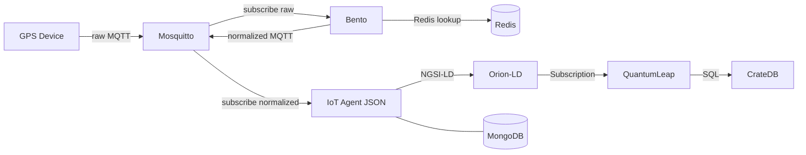

# GPS Connector

GPS telemetry ingestion system connecting IoT GPS devices (Ruptela, Teltonika) to a FIWARE ecosystem with multi-tenant isolation for different municipalities.

## Architecture



### Data Flow

1. **GPS devices** publish telemetry to Mosquitto on raw topic `{device_type}/{imei}/data`
2. **Bento** subscribes to raw topics, extracts IMEI from topic
3. **Bento** looks up IMEI in **Redis** to resolve the tenant (municipality). Unknown IMEIs are dropped.
4. **Bento** normalizes the payload by device type (Ruptela/Teltonika → common format)
5. **Bento** publishes normalized data back to Mosquitto on topic `/{tenant}-{device_type}/{imei}/attrs`
6. **IoT Agent** subscribes to normalized MQTT topics via its built-in MQTT binding, resolves device and tenant from the topic apikey, forwards to Orion-LD
7. **Orion-LD** stores entity data, notifies QuantumLeap via subscription
8. **QuantumLeap** persists time-series data to CrateDB

### Multi-Tenancy

Each municipality is a FIWARE tenant (identified by `Fiware-Service` / `NGSILD-Tenant` header). API keys are scoped per tenant and device type (e.g., `naestved-ruptela`, `copenhagen-teltonika`) to ensure unambiguous tenant resolution at the IoT Agent.

Redis acts as the device registry that Bento uses for:
- **Tenant resolution** — mapping IMEI to municipality
- **Device authorization** — only provisioned IMEIs (present in Redis) are processed; all others are dropped

### MQTT Topic Structure

**Raw topics** (device → Mosquitto):
```
{device_type}/{imei}/data

Examples:
- ruptela/862406075073953/data
- teltonika/864636060329170/data
```

**Normalized topics** (Bento → Mosquitto → IoT Agent):
```
/{tenant}-{device_type}/{imei}/attrs

Examples:
- /naestved-ruptela/862406075073953/attrs
- /copenhagen-teltonika/864636060329170/attrs
```

### Device Payload Formats

**Ruptela** (raw from device):
```json
{"ts":1769594217,"trigger":8,"prio":0,"imei":"862406075073953","ext":0,
 "pos":{"lat":556613783,"lon":125840983,"alt":77,"dir":19250,"spd":46,"sat":15,"hdop":7},
 "data":{"251":"1","28":"1","173":"1"}}
```

**Teltonika** (raw from device):
```json
{"state":{"reported":{"ts":1769610760000,"pr":0,"latlng":"55.661378,12.584098",
 "alt":0,"ang":0,"sat":0,"sp":0,"evt":240,"239":1,"240":0}}}
```

**Normalized** (published by Bento to IoT Agent topic):
```json
{"lat":55.6613783,"lon":12.5840983,"spd":46,"alt":77,"dir":192.50,"sat":15,"ts":1769594217}
```

## Prerequisites

- Docker and Docker Compose
- `mosquitto-clients` package (for testing): `apt install mosquitto-clients`
- `redis-tools` package (for provisioning): `apt install redis-tools`
- `jq` for JSON formatting: `apt install jq`
- `curl` for HTTP requests

## Quick Start

```bash
# Clone the repository
git clone <repo-url>
cd gps-connector

# Start all services
docker-compose up -d

# Wait for services to be ready
./scripts/health-check.sh

# Run the demo
./scripts/demo.sh
```

## Device Registration Flow

When provisioning a new device (from frontend or script), the following steps are needed:

**1. Ensure service group exists** (once per municipality + device_type):
```bash
./scripts/provision-service-group.sh <municipality> <device_type>
# Creates service group with apikey = {municipality}-{device_type}
```

**2. Provision device** (writes to both Redis and IoT Agent):
```bash
./scripts/provision-device.sh <municipality> <imei> <device_type>
# Step 1: redis SET device:{imei} → {municipality}
# Step 2: IoT Agent POST /iot/devices with apikey = {municipality}-{device_type}
```

**3. Ensure QuantumLeap subscription exists** (once per municipality):
```bash
./scripts/create-subscription.sh <municipality>
```

The device can start sending data immediately after provisioning — no service restarts needed.

## Manual Testing

```bash
# 1. Create service group for a municipality
./scripts/provision-service-group.sh naestved ruptela

# 2. Provision a device (writes Redis + IoT Agent)
./scripts/provision-device.sh naestved 123456789012345 ruptela

# 3. Create QuantumLeap subscription
./scripts/create-subscription.sh naestved

# 4. Simulate device data
./scripts/simulate-device.sh ruptela 123456789012345

# 5. Query the entity in Orion-LD
./scripts/query-entity.sh naestved 123456789012345

# 6. Query time-series in QuantumLeap
./scripts/query-timeseries.sh naestved 123456789012345
```

## Adding a New Municipality (Tenant)

1. Create service groups for each supported device type:
   ```bash
   ./scripts/provision-service-group.sh <municipality> ruptela
   ./scripts/provision-service-group.sh <municipality> teltonika
   ```

2. Create QuantumLeap subscription:
   ```bash
   ./scripts/create-subscription.sh <municipality>
   ```

3. Devices can now be provisioned for this municipality.

## Adding a New Device Type

1. Define the payload format (document incoming JSON structure)

2. Add MQTT topic subscription in `bento/config.yaml`:
   ```yaml
   topics:
     - "ruptela/+/data"
     - "teltonika/+/data"
     - "newdevice/+/data"    # Add new topic
   ```

3. Add normalization mapping in `bento/config.yaml`:
   ```yaml
   - check: 'metadata("device_type") == "newdevice"'
     processors:
       - mapping: |
           root.lat = this.your.latitude.path
           root.lon = this.your.longitude.path
           root.spd = this.your.speed.path
           root.ts = this.your.timestamp.path
   ```

4. Restart Bento:
   ```bash
   docker-compose restart bento
   ```

5. Create service groups for existing municipalities:
   ```bash
   ./scripts/provision-service-group.sh naestved newdevice
   ./scripts/provision-service-group.sh copenhagen newdevice
   ```

## Monitoring and Debugging

**View Bento logs:**
```bash
docker-compose logs -f bento
```

**View IoT Agent logs:**
```bash
docker-compose logs -f iot-agent
```

**Check all MQTT messages (raw + normalized):**
```bash
mosquitto_sub -h localhost -t '#' -v
```

**Check only normalized messages (Bento output):**
```bash
mosquitto_sub -h localhost -t '/+/+/attrs' -v
```

**Verify Redis device registry:**
```bash
redis-cli KEYS "device:*"
redis-cli GET "device:862406075073953"
```

**CrateDB Admin UI:**
Open http://localhost:4200 in browser

**Query CrateDB directly:**
```sql
SELECT * FROM "mtnaestved"."etgpstracker" ORDER BY time_index DESC LIMIT 10;
```

## Troubleshooting

1. **Device data not appearing in Orion-LD**
   - Check Bento logs for "Unprovisioned device" warnings (IMEI not in Redis)
   - Verify Redis mapping: `redis-cli GET device:{imei}`
   - Verify device is provisioned in IoT Agent: `./scripts/list-devices.sh <municipality>`
   - Check normalized MQTT topic: `mosquitto_sub -h localhost -t '/+/+/attrs' -v`

2. **Time-series not appearing in QuantumLeap**
   - Verify subscription exists
   - Check QuantumLeap logs: `docker-compose logs quantumleap`
   - Ensure CrateDB is healthy

3. **IoT Agent returns 404**
   - Service group may not exist for this tenant/device type combination
   - Device may not be provisioned
   - Verify apikey format is `{municipality}-{device_type}`

4. **Bento drops all messages**
   - Check Redis connectivity: `redis-cli -h localhost ping`
   - Verify Redis keys exist: `redis-cli KEYS "device:*"`

## API Reference

- [FIWARE IoT Agent JSON](https://fiware-iotagent-json.readthedocs.io/)
- [FIWARE Orion-LD](https://github.com/FIWARE/context.Orion-LD)
- [FIWARE QuantumLeap](https://quantumleap.readthedocs.io/)
- [Bento Documentation](https://warpstreamlabs.github.io/bento/docs/about/)
- [Mosquitto](https://mosquitto.org/documentation/)

## Known Limitations

### Device Authentication

Mosquitto allows anonymous connections. There is no client-level authentication (username/password, TLS client certificates) at the MQTT broker. Device identity is verified only by IMEI presence in Redis, which is not a secret — IMEIs are printed on device labels and appear in procurement documents. Spoofing a known IMEI from any network-accessible client is possible.

Teltonika devices do not support MQTT username/password authentication, which limits options for traditional client auth. A Mosquitto dynamic security plugin backed by Redis could reject unknown IMEIs at connection time (before messages enter the broker), but would not prevent spoofing of known IMEIs.

### Data Durability

If Bento, the IoT Agent, or downstream services (Orion-LD, QuantumLeap) go down, in-flight messages may be lost. Mosquitto is a message router, not a message store. QoS 1 provides at-least-once delivery to connected subscribers, but if Bento is disconnected, messages queue only up to `max_queued_messages` (default 1000) for persistent sessions. There is no dead-letter queue, disk buffer, or replay mechanism.

### Service Redundancy

All services run as single instances with no replication, failover, or health-based restart orchestration beyond Docker's `restart: unless-stopped` policy.

### Redis as Single Point of Failure

Redis is on the hot path for every message (tenant resolution + device authorization). If Redis is unavailable, Bento cannot resolve any device and all messages are dropped. Redis persistence is enabled but there is no replication or sentinel setup.

### Encryption

All communication between services (MQTT, HTTP) is unencrypted. Device-to-Mosquitto traffic traverses the public internet without TLS.

### Rate Limiting

There is no throttling on MQTT ingress or between internal services. A malicious or malfunctioning device could flood the pipeline.

### Dual Write on Provisioning

Device provisioning requires writing to both Redis and the IoT Agent (MongoDB). These are not transactional — if one write succeeds and the other fails, the system is in an inconsistent state. The provisioning frontend/scripts must handle this.
