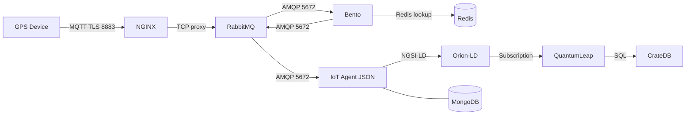

# GPS Connector

GPS telemetry ingestion system connecting IoT GPS devices (Teltonika) to a FIWARE ecosystem with multi-tenant isolation for different municipalities.

## Architecture



### Data Flow

1. **GPS devices** publish telemetry via MQTT TLS to **NGINX** on port 8883, which proxies TCP traffic to **RabbitMQ** on raw topic `{device_type}/{imei}/data`
2. **Bento** consumes raw messages from RabbitMQ via AMQP (queue `bento-gps-raw` bound to `amq.topic` with routing key `teltonika.*.data`), extracts IMEI from routing key
3. **Bento** looks up IMEI in **Redis** to resolve the tenant (municipality). Unknown IMEIs are dropped.
4. **Bento** normalizes the payload to a common format
5. **Bento** publishes normalized data back to RabbitMQ via AMQP on routing key `.{tenant}-{device_type}.{imei}.attrs`
6. **IoT Agent** consumes normalized messages from RabbitMQ via AMQP from the shared `amq.topic` exchange, resolves device and tenant from the routing key, forwards to Orion-LD
7. **Orion-LD** stores entity data, notifies QuantumLeap via subscription
8. **QuantumLeap** persists time-series data to CrateDB

### Multi-Tenancy

Each municipality is a FIWARE tenant (identified by `Fiware-Service` / `NGSILD-Tenant` header). API keys are scoped per tenant and device type (e.g., `naestved-teltonika`, `copenhagen-teltonika`) to ensure unambiguous tenant resolution at the IoT Agent.

Redis acts as the device registry that Bento uses for:
- **Tenant resolution** — mapping IMEI to municipality
- **Device authorization** — only provisioned IMEIs (present in Redis) are processed; all others are dropped

### Topic / Routing Key Structure

**Raw** (device → RabbitMQ via MQTT, converted to AMQP routing key):
```
MQTT topic:        {device_type}/{imei}/data
AMQP routing key:  {device_type}.{imei}.data

Examples:
- teltonika/864636060329170/data  →  teltonika.864636060329170.data
```

**Normalized** (Bento → RabbitMQ → IoT Agent, all AMQP):
```
AMQP routing key:  .{tenant}-{device_type}.{imei}.attrs

Examples:
- .copenhagen-teltonika.864636060329170.attrs
```

### Device Payload Formats

**Teltonika** (raw from device):
```json
{"state":{"reported":{"ts":1769610760000,"pr":0,"latlng":"55.661378,12.584098",
 "alt":0,"ang":0,"sat":0,"sp":0,"evt":240,"239":1,"240":0}}}
```

**Normalized** (published by Bento to IoT Agent topic):
```json
{"lat":55.6613783,"lon":12.5840983,"spd":46,"ts":1769594217,"ignition":1,"moving":0}
```

## Prerequisites
> **Note:** All scripts require a bash environment. On Windows, use WSL (Windows Subsystem for Linux).
- Docker and Docker Compose
- `mosquitto-clients` package (for MQTT testing against RabbitMQ): `apt install mosquitto-clients`
- `redis-tools` package (for provisioning): `apt install redis-tools`
- `jq` for JSON formatting: `apt install jq`
- `curl` for HTTP requests
- `openssl` for TLS certificate generation: `apt install openssl`

## Quick Start

```bash
# Clone the repository
git clone <repo-url>
cd gps-connector

# Generate tls certificates
./scripts/generate-mtls-certs.sh <host> #localhost / Ngrok

# Start all services (Docker Compose v2)
docker compose up -d
# or for older Docker versions
docker-compose up -d

# Wait for services to be ready
./scripts/health-check.sh

# Run the demo
./scripts/demo.sh
```

## Device Registration Flow

When provisioning a new device (from frontend or script), the following steps are needed:

**1. Ensure service group exists** (once per municipality + device_type):
```bash
./scripts/provision-service-group.sh <municipality> <device_type>
# Creates service group with apikey = {municipality}-{device_type}
```
**2. Ensure QuantumLeap subscription exists** (once per municipality):
```bash
./scripts/create-subscription.sh <municipality>
```

**3. Provision device** (writes to both Redis and IoT Agent):
```bash
./scripts/provision-device.sh <municipality> <imei> <device_type>
# Step 1: redis SET device:{imei} → {municipality}
# Step 2: IoT Agent POST /iot/devices with apikey = {municipality}-{device_type}
```

The device can start sending data immediately after provisioning — no service restarts needed.

## Manual Testing

```bash

# 0. Generate TLS certificates (if not already done)
./scripts/generate-mtls-certs.sh localhost # Ngrok if using external port
docker compose restart rabbitmq

# 1. Create service group for a municipality
./scripts/provision-service-group.sh naestved teltonika

# 2. Create QuantumLeap subscription
./scripts/create-subscription.sh naestved

# 3. Provision a device (writes Redis + IoT Agent)
./scripts/provision-device.sh naestved 123456789012345 teltonika

# 4. Simulate device data
./scripts/simulate-device.sh teltonika 123456789012345

# 5. Query the entity in Orion-LD
./scripts/query-entity.sh naestved 123456789012345

# 6. Query time-series in QuantumLeap
./scripts/query-timeseries.sh naestved 123456789012345
```

## Adding a New Municipality (Tenant)

1. Create service groups for each supported device type:
   ```bash
   ./scripts/provision-service-group.sh <municipality> teltonika
   ```

2. Create QuantumLeap subscription:
   ```bash
   ./scripts/create-subscription.sh <municipality>
   ```

3. Devices can now be provisioned for this municipality.

## Adding a New Device TYPE

1. Define the payload format (document incoming JSON structure)

2. Add AMQP binding in `bento/config.yaml`:
   ```yaml
   bindings_declare:
     - exchange: amq.topic
       key: "teltonika.*.data"
     - exchange: amq.topic
       key: "newdevice.*.data"    # Add new binding
   ```

3. Add normalization mapping in `bento/config.yaml`:
   ```yaml
   - check: 'metadata("device_type") == "newdevice"'
     processors:
       - mapping: |
           root.lat = this.your.latitude.path
           root.lon = this.your.longitude.path
           root.spd = this.your.speed.path
           root.ts = this.your.timestamp.path
   ```

4. Restart Bento:
   ```bash
   docker-compose restart bento #docker compose if on new docker
   ```

5. Create service groups for existing municipalities:
   ```bash
   ./scripts/provision-service-group.sh naestved newdevice
   ./scripts/provision-service-group.sh copenhagen newdevice
   ```
   
6. Add simulation support in `scripts/simulate-device.sh`:
   - Add a `publish_newdevice()` function with the correct payload format
   - Add a case in the switch statement for the new device type

## Monitoring and Debugging

> **Note:** Use `docker compose` or `docker-compose` depending on your Docker version.

**View Bento logs:**
```bash
docker-compose logs -f bento
```

**View IoT Agent logs:**
```bash
docker-compose logs -f iot-agent
```

**Check raw MQTT messages (device ingress):**
```bash
mosquitto_sub -h localhost -p 8883 --cafile mosq_certs/ca.crt --cert mosq_certs/client.crt --key mosq_certs/client.key -t '#' -v
```

**Check RabbitMQ queues and bindings (normalized messages flow via AMQP internally):**
```bash
docker compose exec rabbitmq rabbitmqctl list_queues name messages consumers
docker compose exec rabbitmq rabbitmqctl list_bindings source_name destination_name routing_key
```

**RabbitMQ Management UI:**
Open http://localhost:15673 (login: iot_pipeline / changeme)

**Verify Redis device registry:**
```bash
redis-cli KEYS "device:*"
redis-cli GET "device:862406075073953"
```

**CrateDB Admin UI:**
Open http://localhost:4200 in browser

**Query CrateDB directly:**
```sql
SELECT * FROM "mtnaestved"."etgpstracker" ORDER BY time_index DESC LIMIT 10;
```

## Troubleshooting

> **Note:** Use `docker compose` or `docker-compose` depending on your Docker version.

1. **Device data not appearing in Orion-LD**
   - Check Bento logs for "Unprovisioned device" warnings (IMEI not in Redis)
   - Verify Redis mapping: `redis-cli GET device:{imei}`
   - Verify device is provisioned in IoT Agent: `./scripts/list-devices.sh <municipality>`
   - Check RabbitMQ queues: `docker compose exec rabbitmq rabbitmqctl list_queues name messages consumers`

2. **Time-series not appearing in QuantumLeap**
   - Verify subscription exists
   - Check QuantumLeap logs: `docker-compose logs quantumleap`
   - Ensure CrateDB is healthy

3. **IoT Agent returns 404**
   - Service group may not exist for this tenant/device type combination
   - Device may not be provisioned
   - Verify apikey format is `{municipality}-{device_type}`

4. **Bento drops all messages**
   - Check Redis connectivity: `redis-cli -h localhost ping`
   - Verify Redis keys exist: `redis-cli KEYS "device:*"`

## API Reference

- [FIWARE IoT Agent JSON](https://fiware-iotagent-json.readthedocs.io/)
- [FIWARE Orion-LD](https://github.com/FIWARE/context.Orion-LD)
- [FIWARE QuantumLeap](https://quantumleap.readthedocs.io/)
- [Bento Documentation](https://warpstreamlabs.github.io/bento/docs/about/)
- [RabbitMQ MQTT Plugin](https://www.rabbitmq.com/docs/mqtt)

## Known Limitations

### Device Authentication

Devices connect to NGINX on port 8883, which acts as a TCP proxy to RabbitMQ. RabbitMQ terminates TLS and validates client certificates (mTLS) — devices must present a valid certificate signed by the CA to connect. Device identity is additionally verified by IMEI presence in Redis. Spoofing requires both a valid client certificate AND a known IMEI.
Teltonika devices support mTLS which is why this approach was chosen over username/password authentication.

### Data Durability

RabbitMQ provides durable queues for both the Bento consumer (`bento-gps-raw`) and the IoT Agent AMQP consumer (`iotaqueue`), so messages survive broker restarts. The MQTT plugin still uses transient queues for device ingress (QoS 0), so messages from device to RabbitMQ can be lost during broker restarts.

### Service Redundancy

All services run as single instances with no replication, failover, or health-based restart orchestration beyond Docker's `restart: unless-stopped` policy.

### Redis as Single Point of Failure

Redis is on the hot path for every message (tenant resolution + device authorization). If Redis is unavailable, Bento cannot resolve any device and all messages are dropped. Redis persistence is enabled but there is no replication or sentinel setup.

### Encryption

Device-to-NGINX-to-RabbitMQ traffic is encrypted via mTLS on port 8883. NGINX passes TLS through without termination. Internal service-to-service communication (AMQP on 5672, HTTP between services) remains unencrypted as it runs within the Docker/K8s network.

### Rate Limiting

There is no throttling on MQTT ingress or between internal services. A malicious or malfunctioning device could flood the pipeline.

### Dual Write on Provisioning

Device provisioning requires writing to both Redis and the IoT Agent (MongoDB). These are not transactional — if one write succeeds and the other fails, the system is in an inconsistent state. The provisioning frontend/scripts must handle this.
